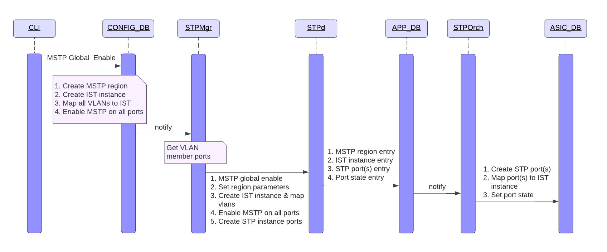
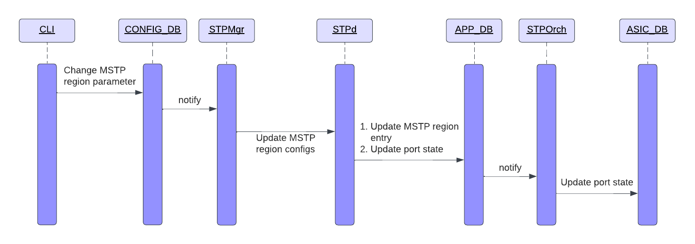
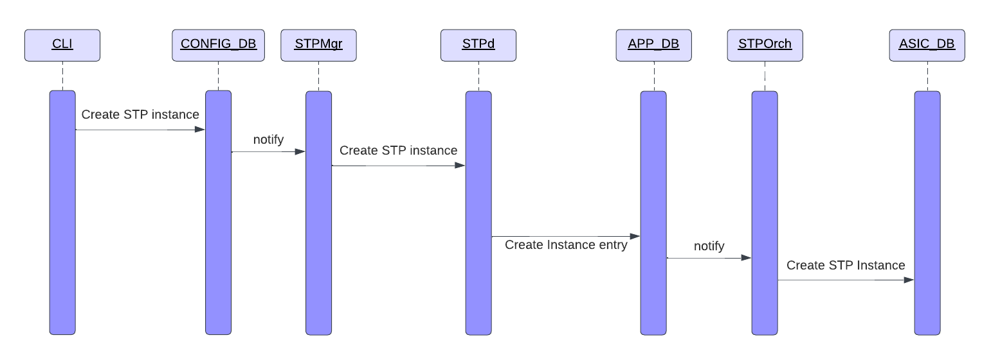
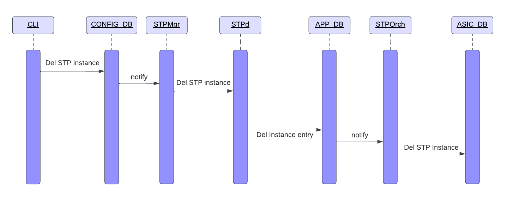
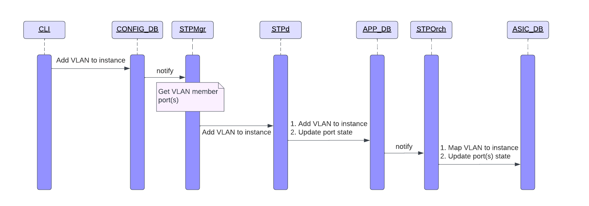
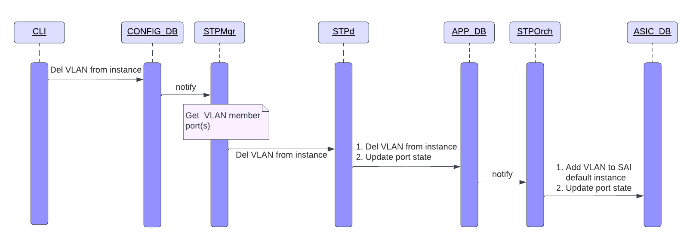


# IEEE 802.1s Multiple Spanning Tree Protocol

**High Level Design** 

## Revision History

|Revision No.|Description|Author|Contributors|Date|
| :- | :- | :- | :- | :- |
|1.0|MSTP Design|[Hamna Rauf](https://github.com/hamnarauf)|[Muhammad Danish](https://github.com/mdanish-kh), [Hafiz Mati ur Rehman](https://github.com/Mati86)  & [Arsalan Ahmad](https://github.com/ahmadarsalan/)|March 20, 2023|

# Table of Contents

* [**Scope**](#scope)
* [**Abbreviations**](#abbreviations)
* [**Overview**](#overview)
* [**Requirements**](#requirements)
* [**Design**](#design)
  - [Architecture](#architecture)
  - [CoPP Configurations](#copp-configurations)
  - [STP Container](#stp-container)
  - [SWSS Container](#swss-container)
* [**Database Changes**](#database-changes)
  - [CONFIG DB](#config-db)
  - [APP DB](#app-db)
* [**YANG Model**](#yang-model)
* [**SAI**](#sai)
* [**Configuration Commands**](#configuration-commands)
  - [Global Level](#global-level)
  - [Region Level](#region-level)
  - [Instance, Interface Level](#instance-interface-level)
  - [Show Commands](#show-commands)
  - [Clear Commands](#clear-commands)
  - [Debug Commands](#debug-commands)
  - [Disabled Commands](#disabled-commands)
* [**Rest API Support**](#rest-api-support)
* [**Sequence Diagrams**](#sequence-diagrams)
  - [MSTP global enable](#mstp-global-enable)
  - [MSTP global disable](#mstp-global-disable)
  - [MSTP region name/version change](#mstp-region-nameversion-change)
  - [Instance creation](#instance-creation)
  - [Instance deletion](#instance-deletion)
  - [Add VLAN to instance](#add-vlan-to-instance)
  - [Del VLAN from instance](#del-vlan-from-instance)
* [**Warm Boot**](#warm-boot)
* [**Testing Requirements**](#testing-requirements)
  - [Unit test cases](#unit-test-cases)
* [**References**](#references)


# Scope
This document describes the High Level Design of Multiple Spanning Tree Protocol.

# Background
This HLD is based on the design provided by PVST HLD.

PVST HLD: https://github.com/sonic-net/SONiC/pull/386

# Abbreviations

|**Term**|**Meaning**|
| :- | :- |
|MSTP|Multiple Spanning Tree Protocol|
|PVST|Per VLAN Spanning Tree|
|STP|Spanning Tree Protocol|
|VLAN|Virtual Local Area Network|
|MSTI|Multiple Spanning Tree Instance|
|CIST|Common Internal Spanning Tree|
|CST|Common Spanning Tree|
|IST|Internal Spanning Tree|
|BPDU|Bridge Protocol Data Unit|
|RSTP|Rapid Spanning Tree Protocol|
|VID|VLAN identifier|
|MSTID|Multiple Spanning Tree Identifier|
|CoPP|Control Plane Policing|

# Overview
Spanning Tree Protocol (STP) prevents bridge looping on LANs that include redundant links. Per VLAN Spanning Tree (PVST) is a modification of STP that allows for running multiple instances of spanning tree on per VLAN basis. Multiple Spanning Tree Protocol (MSTP) allows multiple VLANs to share a single instance of spanning tree, reducing the number of instances needed. These instances are called Multiple Spanning Tree Instances (MSTIs) that reside inside a region. 

MSTP connects all Bridges and LANs with a single Common and Internal Spanning Tree (CIST). The connectivity calculated for the CIST provides the Common Spanning Tree (CST) and Internal Spanning Tree (IST). CST provides interconnection among regions, and IST provides interconnection inside each region corresponding to MSTI 0. MSTP ensures that frames with a given VID are assigned to one and only one MSTI and the assignment is consistent amongst all the Bridges within the region. 

MSTP calculates spanning trees on the basis of Multiple Spanning Tree Bridge Protocol Data Units (MST BPDUs).

<div align="center">
MSTP BPDU Format<br>

</div><br>
<div align="center">
MSTI Configuration Messages<br>

</div>

# Requirements
- Means of assigning VIDs to MSTIDs within each MST Region.
- Assignment of region name and revision number to represent the assignment of VIDs to MSTIDs
- Option of configuring a different root bridge for each MSTI.
- Configuration parameters of Spanning Tree such as forward delay, hello timer, hop count, max age, etc. that will help accomplish above requirements.
- Destination Mac Address for MSTP will be 01:80:C2:00:00:00 
- Interoperability with STP, RSTP and PVST via Protocol Migration.

# Design
## Architecture


### STP Container

STPMgr: Subscribes to CONFIG_DB and STATE_DB tables, parsing configurations and passes to STPd.

STPd: Responsible for all MST protocol related calculations. BPDUs are sent and received in STPd and states are updated accordingly.

STPSync: A process running as a part of STPD. Responsible for updating all the MSTP states in APP DB.

The BPDU rx/tx, handling of changes related to port or LAG using netlink events and STP port state sync to Linux Kernel will function the same as PVST.

### SWSS Container

STPOrch: Responsible for updating the ASIC DB. This includes following tasks:
1. Creating/deleting instances via SAI STP API.
1. Assigning VLAN to instance via SAI STP API and SAI VLAN API.
1. Creation of STP Port and assigning port state with respect to each instance via SAI STP API.
1. Flushing FDB entries via SAI FDB API.

### CoPP Configurations
CoPP will be extended as follows for trapping BPDUs:
```
"stp": {
    "trap_ids"  : "stp,pvrst,mstp",
    "trap_group": "queue1_group1"
}
```

# Database Changes
Following tables will be added or updated in the database:

## CONFIG DB
### STP_GLOBAL_TABLE
```
mode 		  = "pvst" / "mstp"	  ; a new option for mstp
max_hops	  = 1*3DIGIT		  ; max hops (1 to 255, DEF: 20)
```
Other fields of this table i.e mode, rootguard_timeout, forward_delay, hello_time, max_age, priority will also be used to hold the configurations received from CLI.

### MSTP_REGION_TABLE
```
;Stores the MSTP Regional operational details
key               = MSTP|REGION 	  ; MSTP REGION key
region_name 	  = 1*32CHAR	          ; region name (DEF: mac-address of switch)
revision	  = 1*5DIGIT 	          ; region revision number(0 to 65535, DEF: 0)
```

### MSTP_INSTANCE_TABLE
```
;Stores the MSTP instance operational details
key           = MSTP_INSTANCE|"Instance"instanceid	  ; instance id with MSTP_INSTANCE as a prefix
priority      = 1*5DIGIT 			          ; bridge priority (0 to 61440, DEF:32768)
root 	      = "primary" / "secondary" / "default"       ; (DEF: "default")
```

### MSTP_VLAN_TABLE
```
;Stores the STP instance operational details
key               = MSTP_VLAN|"Vlan"vlanid              ; vlan id with MSTP_VLAN as a prefix
instance_id	  = 1*2DIGIT	                        ; instance id vlan is mapped to (0-63, DEF:0)
```

### MSTP_INSTANCE_PORT_TABLE
```
;Stores STP interface details per Instance
key        = MSTP_INSTANCE_PORT|"Instance"instanceid|ifname   ; instanceid|ifname with prefix MSTP_INSTANCE_PORT, ifname can be physical or portchannel name
priority   = 1*3DIGIT                                         ; port priority (0 to 240, DEF:128)
path_cost  = 1*9DIGIT                                         ; port path cost (1 to 200000000)
```

## APP DB
### MSTP_REGION_TABLE
```
;Stores the MSTP regional operational details
key                     = MSTP:REGION	      ; MSTP REGION key
regionname 	        = 1*32CHAR            ; region name (DEF: mac-address of switch)
revision	        = 1*5DIGIT            ; region revision (0 to 65535, DEF: 0)
bridge_id	        = 16HEX	              ; bridge id
cist_root_bridge_id	= 16HEX	              ; CIST root’s bridge id
regional_root_bridge_id	= 16HEX	              ; Regional root’s bridge id
external_path_cost	= 1*9DIGIT	      ; path cost to CIST bridge
internal_path_cost 	= 1*9DIGIT	      ; path cost to regional root bridge
root_port               = ifName	      ; Root port name
root_max_age            = 1*2DIGIT	      ; Max age as per CIST root bridge
root_hello_time         = 1*2DIGIT	      ; hello time as per CIST root bridge
root_forward_delay      = 1*2DIGIT	      ; forward delay as per CIST root bridge
root_max_hops		= 1*3DIGIT	      ; max hops as per CIST root bridge
max_age                 = 1*2DIGIT            ; maximum age time in secs (6 to 40, DEF: 20)
hello_time              = 1*2DIGIT            ; hello time in secs (1 to 10, DEF: 2)
forward_delay           = 1*2DIGIT            ; forward delay in secs (4 to 30, DEF: 15)
max_hops	        = 1*3DIGIT	      ; max hops (1 to 255; DEF:20)   
last_topology_change    = 1*10DIGIT           ; time in secs since last topology change occured
topology_change_count   = 1*10DIGIT           ; Number of times topology change occured
instances_configured    = 1*2DIGIT            ; total number of instances configured (DEF: 1)
```

### MSTP_INSTANCE_TABLE
```
;Stores the STP instance operational details
key                       = MSTP_INSTANCE:"Instance"instanceid    ; instance id with MSTP_INSTANCE as a prefix
vlanids	                  = vlan_id-or-range[,vlan_id-or-range]   ; list of VLAN IDs
oper_status	          = "active" / "inactive"                 ; instance is active in mstp
bridge_id                 = 16HEXDIG                              ; bridge id
msti_root_bridge_id       = 16HEXDIG                              ; MSTI regional root’s bridge id
msti_root_path_cost       = 1*9DIGIT	                          ; port path cost to MSTI root
msti_root_port            = ifName	                          ; Root port name
last_topology_change      = 1*10DIGIT                             ; time in sec since last topology change occured 
topology_change_count     = 1*10DIGIT                             ; Number of times topology change occured
```

### MSTP_INSTANCE_PORT_TABLE
```
;Stores STP interface details per Instance
key                 = MSTP_INSTANCE_PORT:"Instance"instanceid:ifname    ; instanceid|ifname with prefix MSTP_INSTANCE_PORT
port_num            = 1*3DIGIT                                          ; port number of bridge port
path_cost           = 1*9DIGIT                                          ; port path cost (1 to 200000000)
priority            = 1*3DIGIT                                          ; port priority (0 to 240, DEF:128)
port_state          = "state"                                           ; STP state-disabled, block, listen, learn, forward
desig_root    	    = 16HEXDIG                                          ; designated root
desig_cost   	    = 1*9DIGIT                                          ; designated cost
desig_bridge  	    = 16HEXDIG                                          ; designated bridge
desig_port    	    = 1*3DIGIT                                          ; designated port
fwd_transitions     = 1*5DIGIT                                          ; number of forward transitions
bpdu_sent           = 1*10DIGIT                                         ; bpdu transmitted
bpdu_received       = 1*10DIGIT                                         ; bpdu received
tcn_sent            = 1*10DIGIT                                         ; tcn transmitted
tcn_received        = 1*10DIGIT                                         ; tcn received
root_guard_timer    = 1*3DIGIT                                          ; root guard current timer value
```

Following already present APP_DB tables are also used for implementation of MSTP:
### STP_PORT_STATE_TABLE 
The table holds the state of a port i.e forwarding, learning, blocking with respect to each instance.
### STP_VLAN_INSTANCE_TABLE 
The table holds the VLAN to instance mapping.
### STP_FASTAGEING_FLUSH_TABLE 
The table informs when the FDB flushing is required. This is done in case of topology change where the mac entries in FDB become inconsistent and there is a need to flush these entries.

# YANG Model
Yang will be extended to support MSTP.
# SAI
Following table shows the SAI Attributes that will be used:

|**Component**|**SAI Attribute**|
| :- | :- |
|STP Instance|SAI_STP_ATTR_VLAN_LIST
||SAI_STP_ATTR_BRIDGE_ID|
||SAI_STP_ATTR_PORT_LIST|
|STP Port|SAI_STP_PORT_ATTR_STP |
||SAI_STP_PORT_ATTR_BRIDGE_PORT|
||SAI_STP_PORT_ATTR_STATE|
|STP Port States|SAI_STP_PORT_STATE_LEARNING|
||SAI_STP_PORT_STATE_FORWARDING|
||SAI_STP_PORT_STATE_BLOCKING|
|VLAN STP Instance|SAI_VLAN_ATTR_STP_INSTANCE|
|Switch STP Attributes|SAI_SWITCH_ATTR_DEFAULT_STP_INST_ID|
||SAI_SWITCH_ATTR_MAX_STP_INSTANCE|

Control trap packets required for MSTP **will be** defined in saihostif.h as SAI_HOSTIF_TRAP_TYPE_MSTP. 

[SAI/saihostif.h](https://github.com/opencomputeproject/SAI/blob/master/inc/saihostif.h)


# Configuration Commands
Following new configuration commands will be provided for configuration of MSTP:
## Global Level
- **config spanning_tree {enable|disable} {mstp|pvst}**
  - Enables or disables mstp at global level on all ports of the switch.
  - Only one mode of STP can be enabled at a time.
- **config spanning_tree max_hops \<max-hops-value\>**
  - Specify the number of maximum hops before the BPDU is discarded inside a region.
  - max-hops-value: Default: 20, range: 1-255

## Region Level
Below commands allow configuring on region basis:

- **config spanning_tree region name \<region-name\>**
  - Edit the name of region
  - region-name: Case sensitive, characters should be less than or equal to 32, default: mac-address of bridge
- **config spanning-tree region revision \<revision-number\>**
  - Revision number is used to track changes in the configuration and to synchronize the configuration across the switches in the same region.
  - revision-number: Default: 0, range: 0-65535

## Instance Level

Below commands allow configuration of an instance:

- **config spanning_tree instance (add|del) \<instance-id\>**
  - Creation or deletion of an instance.
  - instance-id: Default: 0, range: 1-63
  - Instance can not be deleted if VLAN(s) are associated with it. 
- **config spanning_tree instance priority \<instance-id\> \<priority-value\>** 
  - Configure priority of bridge for an instance.
  - instance-id: id of the instance for which bridge priority is to be defined. If the provided instance id is not created yet, an error message is displayed.
  - priority-value: Default: 32768, range: 0-61440 (should be multiple of 4096)
- **config spanning_tree instance root \<instance-id\> (primary | secondary | default)**
  - Configure the bridge as a primary or secondary bridge for an instance. 
  - If there is a need of reverting back then the "default" option is used.
  - instance-id: id of the instance for which root is to be configured. If the provided instance id is not created yet, an error message is displayed.
- **config spanning_tree instance vlan (add|del) \<instance-id\> \<vlan-id\>**
  - VLAN to instance mapping.
  - instance-id: id of the instance to which VLAN is to be mapped. If the provided instance id is not created yet, an error message is displayed.
  - vlan-id: Range: 1-4094. If the provided VLAN is not created yet, an error message is displayed.
  - Instance is only active when there is at least one VLAN member port configured for one of the mapped VLANs.

## Instance, Interface Level
Following commands are used for spanning-tree configurations on per instance, per interface basis:

- **config spanning_tree instance interface priority \<instance-id\> \<ifname\> \<priority-value\>**
  - Configure priority of an interface for an instance.
  - priority-value: Default: 128, range: 0-240
- **config spanning_tree instance interface cost \<instance-id\> \<ifname\> \<cost-value\>**
  - Configure path cost of an interface for an instance.
  - cost-value: Range: 1-200000000

## Show Commands
- show spanning_tree region brief
- show spanning_tree instance \<instance-id\>
- show spanning_tree instance interface \<instance-id\> \<ifname\>
```
Spanning-tree Mode: MSTP

MSTP Region Parameters:
Region Name                     : regionA
Revision                        : 0
CIST Bridge Identifier          : 32768002438eefbc3
CIST Root Identifier            : 32768002438eefbc3
CIST External Path Cost         : 0
CIST Regional Root Identifier   : 32768002438eefbc3
CIST Internal Path Cost         : 0
Instances configured            : 1
Last Topology Change            : 0s
Number of Topology Changes      : 0
Bridge Timers                   : MaxAge 20s Hello 2s FwdDly 15s MaxHops 20
CIST Root Timers                : MaxAge 20s Hello 2s FwdDly 15s MaxHops 20

MSTP instance 0 - VLANs 10, 20, 30
-------------------------------------------------------------------------------------------------

Bridge              MSTI Root Bridge    RootPath  Root Port   LastTopology  Topology
Identifier          Identifier          Cost      Identifier  Change        Change
hex                 hex                                       sec           cnt
32768002438eefbc3   32768002438eefbc3   0         128.13      0             0

MSTP Port Parameters:

Port        Prio Path Port Uplink   State      Designated  Designated          Designated
Num         rity Cost Fast Fast                Cost        Root                Bridge
Ethernet13  128  4    Y    N        FORWARDING 0           32768002438eefbc3   32768002438eefbc3 
```

- show spanning_tree statistics region
- show spanning_tree statistics instance \<instance-id\>
```
MSTP instance 0 - VLANs 10, 20, 30
--------------------------------------------------------------------
PortNum           BPDU Tx     BPDU Rx     TCN Tx     TCN Rx             
Ethernet13        10	      4           3          4
PortChannel15     20	      6           4          1
```

## Clear Commands
- sonic-clear spanning_tree statistics region
- sonic-clear spanning_tree statistics instance \<instance-id\>
- sonic-clear spanning_tree statistics instance interface \<instance-id\> \<ifname\>

## Debug Commands
Following debug commands will be supported for enabling additional logging which can be viewed in /var/log/stpd.log, orchagent related logs can be viewed in /var/log/syslog.

- debug spanning_tree region
- debug spanning_tree instance \<instance-id\>

Following debug commands will be supported for displaying internal data structures

- debug spanning_tree dump region
- debug spanning_tree dump instance \<instance-id\>
- debug spanning_tree dump instance interface \<instance-id\> \<ifname\>

## Disabled Commands
Following commands are used to configure parameters at VLAN level and these commands are disabled if spanning-tree mode is MSTP:

- config spanning_tree vlan (enable|disable) \<vlan\>
- config spanning_tree vlan forward_delay \<vlan\> \<fwd-delay-value\>
- config spanning_tree vlan hello \<vlan\> \<hello-value\>
- config spanning_tree vlan max_age \<vlan\> \<max-age-value\>
- config spanning_tree vlan priority \<vlan\> \<priority-value\>
- config spanning_tree vlan interface cost \<vlan\> \<ifname\> \<value\>
- config spanning_tree vlan interface priority \<vlan\> \<ifname\> \<value\>

Also, Instance level commands will be disabled if spanning-tree mode is PVST.

# Rest API Support
Rest API is out of scope for this HLD.

#  Sequence Diagrams
## MSTP global enable


## MSTP global disable


## MSTP region name/version change


## Instance creation


## Instance deletion


## Add VLAN to instance


## Del VLAN from instance


Update port-state, topology change and instance-interface events remain the same as depicted in sequence diagrams of PVST.

# Warm Boot
Warm boot will not be supported. The IEEE 802.1s standard of MSTP does not define a way to support it as this might cause loops in the network. 

If a user tries to perform a warm boot while MSTP is enabled, an error message will be displayed. User will first need to disable MSTP so the topology converges and reevaluates the paths.


# Testing Requirements
## Unit test cases
### CLI test cases
1. Verify CLI to enable MSTP globally.
1. Verify CLI to disable MSTP globally.
1. Verify CLI to set bridge max-hops.
1. Verify CLI to set MSTP region name.
1. Verify CLI to set MSTP region revision.
1. Verify CLI to create an instance.
1. Verify CLI to delete an instance
1. Verify CLI to set bridge priority in an instance.
1. Verify CLI to set bridge as a primary root for an instance.
1. Verify CLI to set bridge as a secondary root for an instance.
1. Verify CLI to map VLAN to an instance
1. Verify CLI to delete VLAN from an instance.
1. Verify CLI to set interface priority on a per instance basis.
1. Verify CLI to set interface cost on a per instance basis.
1. Verify CLI to display all information related to the region.
1. Verify CLI to display information related to a specific instance.
1. Verify CLI to display information about a specific interface in a specific instance.
1. Verify CLI to display region statistics.
1. Verify CLI to display statistics on a per instance basis.
1. Verify CLI to clear region statistics.
1. Verify CLI to clear statistics on a per instance basis.
1. Verify CLI to clear statistics on a per interface per instance basis.
1. Verify the commands that are disabled for MSTP mode.

### Functional Test Cases
1. Verify CONFIG DB is populated with configured MSTP parameters.
1. Verify multiple VLANs can be mapped to a single instance.
1. Verify instance STP ports are created for its VLAN members.
1. Verify correct format of MSTP BPDU.
1. Verify MSTP traps are created.
1. Verify correct operation of CIST and MSTIs.
1. Verify two bridges are in the same region only if they have the same region name, revision and instance to VLAN mapping.
1. Verify the loop free topology inside and between regions.
1. Verify the operational values of forward delay, max age, hello timer and max hops are of the CIST root.
1. Verify FDB flush as a result of topology change.
1. Verify instance is active only when there is at least one VLAN member of any of the VLANs that are mapped to it.
1. Verify altering bridge priority can alter the selection of CIST root, regional root and MSTI root.
1. Verify altering port priority can alter the selection of designated port.
1. Verify making the bridge as root for an MSTI by altering the root property of an instance to primary.
1. Verify max-hops by changing value.
1. Verify MSTP interoperability with STP, RSTP and PVST.
1. Verify MSTP operational data is synced to APP DB and ASIC DB correctly.
1. Verify MSTP over LAG.
1. Verify MSTP over static breakout ports.

### Logging and Debugging Test Cases
1. Verify debugging logs for a region.
1. Verify debugging logs for an instance.
1. Verify debugging of internal data structure of region.
1. Verify debugging of internal data structure of an instance.
1. Verify debugging of internal data structure of a specific interface in an instance. 

### SAI
1. Verify creation of STP instance.
1. Verify adding VLAN to an instance.
1. Verify deleting VLAN from an instance.
1. Verify adding a port to an instance.
1. Verify deleting port from an instance.
1. Verify port state for different instances.

### L3
1. Verify normal flow of L3 traffic with the MSTP topology.

# References
1. [PVST HLD](https://github.com/sonic-net/SONiC/blob/master/doc/stp/SONiC_PVST_HLD.md)
1. [IEEE 802.1Q-2018](https://standards.ieee.org/ieee/802.1Q/6844/)
1. [IEEE 802.1s-2002](https://standards.ieee.org/ieee/802.1s/1042/)
